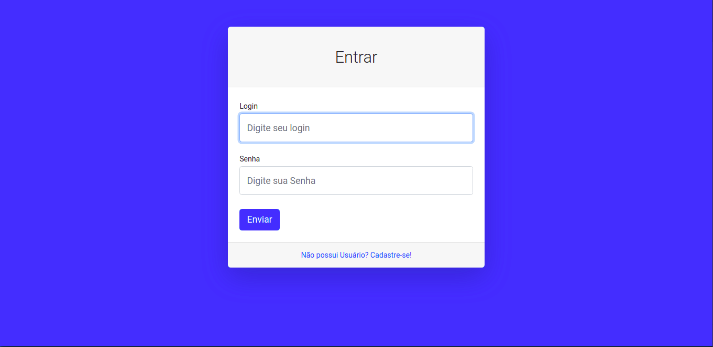
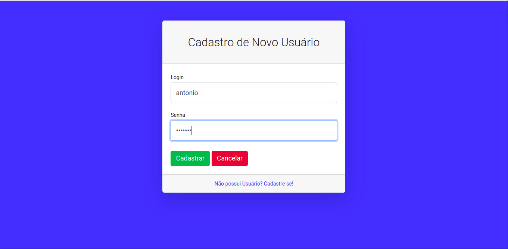
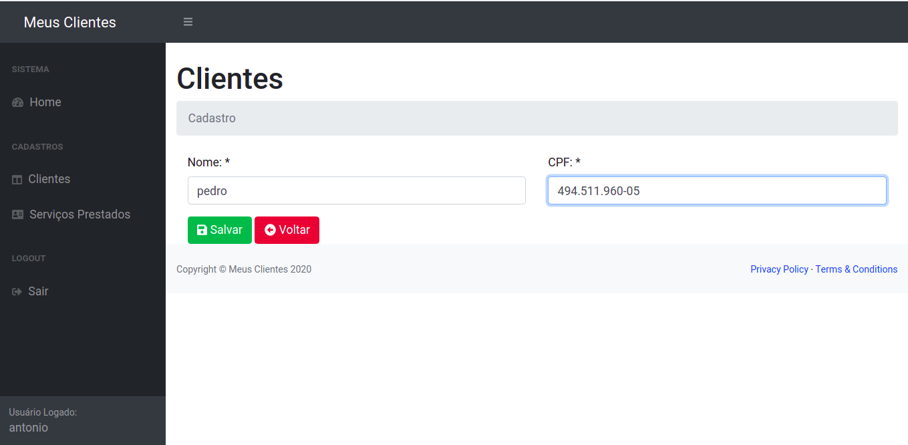
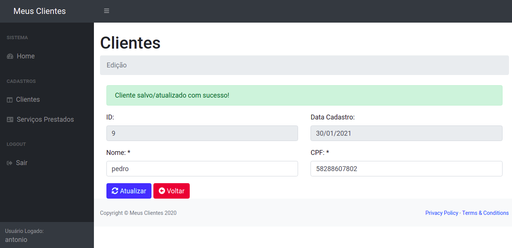
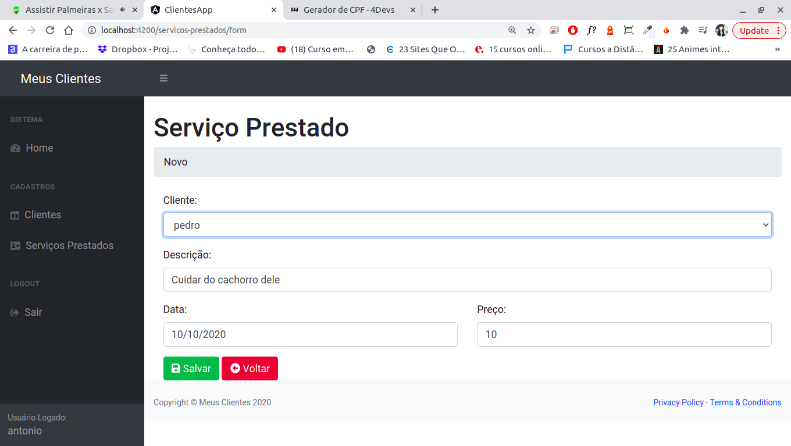
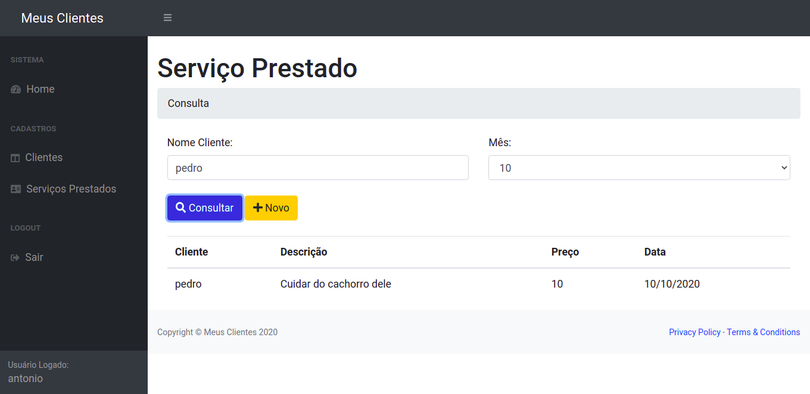

# Clientes - Angular 9 + SpringBoot

Projeto desenvolvido ao longo da primeira parte do curso "Angular9 + Spring Boot". Consiste em um sistema de gerenciamento de clientes e serviços.

## Funcionalidade

Há uma API desenvolvida em Spring Boot, na qual é cadastrado/removido/editado no banco de dados os clientes e serviços, essa API também contêm uma autenticação de usuário. Além disso, toda a interface é feita com o usuário por meio de uma aplicação Angular que está consumindo esta API Java.

**1 - Login/Cadastro** - Assim que iniciada a aplicação, há uma tela onde o usuário deve se autenticar. Caso já tenha uma conta basta acessa-lá, caso contrário deve-se criar uma. 

 
 

**2 - Cliente** - É possivel criar/remover/editar clientes.

 
 

**3 - Serviço** - É possivel criar/remover/editar serviços, estes são associados a um cliente. Além de adicionar serviços, é possível consultar também, basta passar o nome do cliente e o mês.

 
 

**4 - Logout** - Caso se deseje sair da aplicação, basta clicar em logout

## Execução

Tanto no Windows quanto no Linux a execução é feita a partir de uma IDE de sua preferência, para executar a API Java. 
A API ficará rodando localmente na porta 8080.

Além da API é necessário executar também a aplicação Angular. Para isso deve-se executar:

```bash
npm install
npm start
```

Esta por sua vez ficará hospedada na porta 4200.